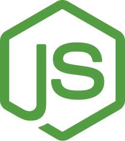

<h1 align="center">
  
</h1>

  
  

  
  

## About Me

Full-stack engineer focused on building **high-performance backend systems and modern web applications**.

I work primarily across **Go, TypeScript, and Rust**, designing scalable services, developer tooling, and internal platforms.

- Senior Full-Stack Engineer  
- Contributor to **[BlueBuild]**
- Interested in **systems programming, distributed systems, and platform engineering**
- Linux / OSS enthusiast

Connect with me on **[LinkedIn]** or open a discussion on my **[issues page]**.

## Tech I Work With

  <table>
    <tr>
      <td align="center" width="96">
        
         Go
      </td>
      <td align="center" width="96">
        
         TypeScript
      </td>
      <td align="center" width="96">
        
         Node
      </td>
      <td align="center" width="96">
        
         Docker
      </td>
      <td align="center" width="96">
        
         Fedora
      </td>
      <td align="center" width="96">
        
         uBlue
      </td>
    </tr>
  </table>

  

## Open Source

[Bluebuild]: https://blue-build.org  
[issues page]: https://github.com/HexSleeves/HexSleeves/issues  
[LinkedIn]: https://www.linkedin.com/in/jacob-lecoq  

  

